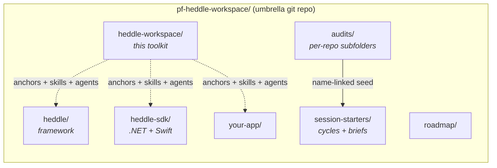
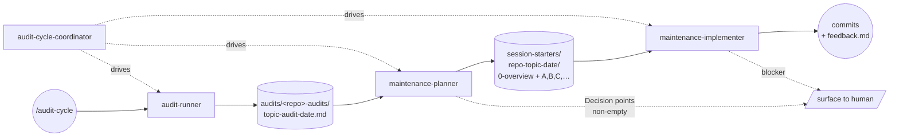

# heddle-workspace

Everything you need to assemble, run, and sync a Heddle-based project
workspace — agent tooling and workspace lifecycle in one place. The
sibling repos are [heddle](https://github.com/getheddle/heddle),
[heddle-sdk](https://github.com/getheddle/heddle-sdk),
[warp-design](https://github.com/getheddle/warp-design), and the
planned `warp`.

Three pillars:

### 1. Agent tooling

So that AI coding assistants working in any `getheddle/*` repo:

1. **Orient fast.** One canonical set of cross-repo anchors instead of
   re-reading each project's docs from scratch.
2. **Respect invariants.** Non-negotiable design rules and the framework's
   philosophy live in one place; sibling repos point here.
3. **Stay coherent across the seam.** Schema source-of-truth direction,
   subject conventions, and wire-protocol rules are documented once.

### 2. Workspace lifecycle

So that a Heddle-based project can be assembled, moved between
machines, and kept in sync across team members:

1. **Manifest-driven layout.** `workspace.yaml` declares which repos
   belong in the workspace and where their remotes live. The umbrella
   git repo (private, on the project's own org) tracks loose files,
   audit reports, agent adapter config, and the manifest — never the
   contents of the child repos.
2. **Interactive bootstrap.** `bin/workspace init` walks you through
   creating a new workspace; `bin/workspace link` pulls an existing
   one into a fresh machine; `bin/workspace sync` reconciles missing
   children. An explicit `(local-only)/` carve-out keeps
   machine-specific content off the wire.
3. **Mergeable across machines.** Because the umbrella is a normal
   git repo, two divergent workspaces (work / home) reconcile through
   ordinary `git merge`. See `docs/WORKSPACE_SYNC_DESIGN.md` for the
   full spec.

### 3. Audit-driven maintenance

So that quality stays high without ad-hoc heroics. The workspace
treats *audits* as first-class artifacts that *seed* maintenance work,
and ships a four-agent pipeline to drive the loop:

1. **`audit-runner`** — performs a typed audit (security, deps,
   schema, contrib, `docs-editorial`, `docs-technical`,
   `docs-persona`, perf, invariants, data) against one repo and writes
   the report under `audits/<repo>-audits/`.
2. **`maintenance-planner`** — converts a completed audit into a
   maintenance-cycle subfolder under `session-starters/`, surfacing
   any unresolved decision points for human input.
3. **`maintenance-implementer`** — executes one lettered session brief
   from a cycle, surgically, with paired feedback.
4. **`audit-cycle-coordinator`** — drives the whole loop end-to-end;
   interactive or scheduled.

Full convention: [`docs/AUDITS.md`](docs/AUDITS.md). Default audience
catalog for `docs-persona` audits:
[`docs/AUDIENCE_PERSONAS.md`](docs/AUDIENCE_PERSONAS.md).

## At a glance

The workspace and the three pillars:



The audit → maintenance loop:



## Tool catalog — when, why, how

Every entry below is a *vendor-neutral* artifact. Coding-agent adapters
make it discoverable in your tool of choice (see "Agent adapters"
later).

### Skills — user-invokable workflows

Invoke as `/<skill-name>` in a Claude Code session, or read the
linked `SKILL.md` directly in any other agent.

| Skill | When to reach for it | Why it exists |
|---|---|---|
| [`heddle-orient`](skills/heddle-orient/SKILL.md) | Session start, or after compaction, when working in any `getheddle/*` repo. | Cheap context entry — one screen instead of re-reading every anchor. |
| [`heddle-invariants`](skills/heddle-invariants/SKILL.md) | Mid-session, before a structural change you weren't already planning. | Pulls the non-negotiable rules into context without a full anchor re-read. |
| [`heddle-contract-sync`](skills/heddle-contract-sync/SKILL.md) | A change touched `heddle.core.messages`, `schemas/v1/*`, or a vendored SDK model. | Verifies/refreshes the schema sync from `heddle` (upstream) to `heddle-sdk` (downstream). |
| [`heddle-preflight`](skills/heddle-preflight/SKILL.md) | Before every commit on a structural change. | Single repo-aware command runs lint, types, tests, docs build, CHANGELOG check. |
| [`heddle-new-worker`](skills/heddle-new-worker/SKILL.md) | Adding a new LLM or processor worker. | Walks the scaffolding CLI + I/O contract rules. |
| [`cross-repo-pr`](skills/cross-repo-pr/SKILL.md) | A change spans `heddle` + `heddle-sdk` and needs paired PRs. | Encodes merge order (upstream → downstream) and cross-linked PR bodies. |
| [`warp-adr`](skills/warp-adr/SKILL.md) | Recording a design decision in `warp-design/decisions/`. | Format guard — NNNN-kebab-title.md with Status/Context/Decision/Consequences. |
| [`audit-cycle`](skills/audit-cycle/SKILL.md) | Auditing a repo, fixing audit findings, or scheduling periodic maintenance. | Routes the request to the right audit/maintenance agent and enforces the name-link between audits and cycles. |

### Subagents — spawn for isolated, focused jobs

Spawn via the `Agent` tool (Claude Code) or whatever delegation
mechanism your agent supports. Each definition is a single `.md` under
[`agents/`](agents/INDEX.md).

| Subagent | When to spawn it | Why prefer it over the main thread |
|---|---|---|
| [`heddle-architect`](agents/heddle-architect.md) | **Before** writing non-trivial code (new worker, new orchestrator, schema change, cross-repo feature). | Read-only design pass in isolated context — returns a plan, not code. Keeps the top thread uncluttered. |
| [`heddle-invariant-guard`](agents/heddle-invariant-guard.md) | A staged diff touches workers, router, orchestrator, bus, or council code. | Enforces the permanent invariant red lines without your main thread having to re-read them. |
| [`heddle-contract-reviewer`](agents/heddle-contract-reviewer.md) | A diff touches `core/messages.py`, `schemas/v1/*`, .NET models, Swift models, or NATS subject names. | Cross-repo wire-protocol coherence — the seam most likely to drift silently. |
| [`mkdocs-doc-reviewer`](agents/mkdocs-doc-reviewer.md) | A diff touches `docs/`, `mkdocs.yml`, or included Markdown. | Catches nav drift, broken refs, stale code blocks. |
| [`pyproject-deps-reviewer`](agents/pyproject-deps-reviewer.md) | A diff touches `pyproject.toml` or `uv.lock`. | License compatibility (MPL-2.0), missing extras, version skew. |
| [`audit-runner`](agents/audit-runner.md) | "Audit `<repo>` for `<type>`." Type catalog in [`docs/AUDITS.md`](docs/AUDITS.md). | Produces the durable audit artifact that seeds a maintenance cycle. Stateless — scheduleable. |
| [`maintenance-planner`](agents/maintenance-planner.md) *(stub)* | A completed audit needs to become an executable maintenance cycle. | Converts findings into lettered session briefs; refuses to plan items in `Decision points`. |
| [`maintenance-implementer`](agents/maintenance-implementer.md) *(stub)* | One lettered session brief in a cycle is ready to execute. | Surgical, single-letter execution with paired feedback — never grabs more scope than the brief. |
| [`audit-cycle-coordinator`](agents/audit-cycle-coordinator.md) *(stub)* | Drive the whole audit → plan → implement loop, especially when unattended. | Composition over inheritance — one agent that orchestrates the other three. Scheduleable via `/schedule`, `/loop`, or `CronCreate`. |

### Anchors — read-deeper docs (not user-invokable)

Loaded on demand by skills/subagents, or read directly when you need
the canonical answer:

| Anchor | Use it when |
|---|---|
| [`anchors/WORKSPACE.md`](anchors/WORKSPACE.md) | You need the workspace-detection rules, sibling-layout convention, or `bin/workspace` quick reference. |
| [`anchors/ECOSYSTEM.md`](anchors/ECOSYSTEM.md) | You forgot which repo owns what. |
| [`anchors/PHILOSOPHY.md`](anchors/PHILOSOPHY.md) | You're about to design something and want to check the trade-offs aren't being inverted. |
| [`anchors/INVARIANTS.md`](anchors/INVARIANTS.md) | You're about to break or skirt one of the non-negotiables. |
| [`anchors/CONTRACT_MAP.md`](anchors/CONTRACT_MAP.md) | A schema/wire-protocol change is in flight and you need the propagation order. |

### Convention references

| Doc | What it answers |
|---|---|
| [`docs/AUDITS.md`](docs/AUDITS.md) | What audit types exist, what each one inspects, what the audit artifact looks like. |
| [`docs/AUDIENCE_PERSONAS.md`](docs/AUDIENCE_PERSONAS.md) | Which personas a `docs-persona` audit can adopt; how to add a new one. |
| [`docs/MACHINE_PROFILE.md`](docs/MACHINE_PROFILE.md) | How `(local-only)/machine.yaml` declares per-machine capabilities so skills degrade gracefully. |
| [`docs/AGENT_ADAPTERS.md`](docs/AGENT_ADAPTERS.md) | Which discovery directory each coding agent uses, and what the installer writes. |
| [`docs/WORKSPACE_SYNC_DESIGN.md`](docs/WORKSPACE_SYNC_DESIGN.md) | The umbrella-repo design rationale, lifecycle commands, and conflict-resolution model. |


| Path | Contents |
|---|---|
| `AGENTS.md` | Canonical agent instructions. Read first. |
| `CLAUDE.md` | Claude-specific thin pointer to `AGENTS.md`. |
| `anchors/WORKSPACE.md` | Workspace layout, detection, cross-repo git + path conventions. |
| `anchors/ECOSYSTEM.md` | Map of `getheddle/*` repos and how they relate. |
| `anchors/PHILOSOPHY.md` | Design opinions: who Heddle is for, what trade-offs are intentional. |
| `anchors/INVARIANTS.md` | Pointer to `heddle/docs/DESIGN_INVARIANTS.md` + cross-repo invariants. |
| `anchors/CONTRACT_MAP.md` | Schema source-of-truth, sync direction, wire-protocol contract. |
| `skills/INDEX.md` + `skills/<name>/SKILL.md` | Canonical user-invokable workflows (`/heddle-orient`, etc.). |
| `agents/INDEX.md` + `agents/<name>.md` | Canonical subagent definitions (architect, reviewers). |
| `hooks/settings.template.json` | Opt-in hooks template for Python lint + cross-repo edit warnings. See `hooks/README.md`. |
| `install.sh` | Legacy Claude bootstrap: symlink toolkit `skills/` and `agents/` into a target repo's `.claude/`; optional `--hooks` to drop the template. |
| `bin/install-agent-adapters` | Install or refresh coding-agent adapters from the canonical toolkit files. |
| `bin/workspace` | `workspace` CLI: `init / link / sync / status / add / rm / doctor / agent-adapters`. Requires `uv`. |
| `src/heddle_workspace/` | Python package backing the CLI. |
| `docs/WORKSPACE_SYNC_DESIGN.md` | Full design spec for the umbrella-repo lifecycle. |
| `docs/AGENT_ADAPTERS.md` | Source-backed map of coding-agent discovery paths installed by the adapter command. |
| `docs/AUDITS.md` | Audit-type catalog and document shape (used by `audit-runner` / `/audit-cycle`). |
| `docs/AUDIENCE_PERSONAS.md` | Default persona list for `docs-persona` audits (Operator, Worker Author, Framework Contributor, Cluster Operator, Evaluator). |
| `docs/MACHINE_PROFILE.md` | Schema for the per-machine `(local-only)/machine.yaml` profile and capability keys. |

## The `workspace` CLI

The CLI bootstraps and syncs a Heddle workspace as a private umbrella
git repo on your project's own GitHub org. Full design rationale is in
[`docs/WORKSPACE_SYNC_DESIGN.md`](docs/WORKSPACE_SYNC_DESIGN.md);
quick reference in
[`anchors/WORKSPACE.md`](anchors/WORKSPACE.md#binworkspace-cli--quick-reference).

Prerequisite: [`uv`](https://docs.astral.sh/uv/) on PATH.

### Bootstrap a new workspace (Machine A)

```bash
cd /path/to/your-project-workspace
./heddle-workspace/bin/workspace init
# Interactive wizard: name, project GitHub org, which detected child
# repos to include in the manifest.
```

The wizard writes `.heddle-workspace.yaml`, a workspace-aware
`.gitignore`, creates an untracked `(local-only)/` carve-out, and
commits the umbrella's first revision. Then publish:

```bash
gh repo create <project-org>/<workspace-name> --private --source=. --remote=origin
git push -u origin main
```

### Link a divergent workspace on a second machine (Machine B)

```bash
cd /path/to/existing-divergent-workspace
git add -A && git commit -m "machine-b state at link time"
./heddle-workspace/bin/workspace link git@github.com:<project-org>/<workspace-name>.git
# fetches + git merge --allow-unrelated-histories
# stops on conflicts for you to resolve manually
./heddle-workspace/bin/workspace sync     # after conflicts resolved
git push origin main
```

### Day-to-day

```bash
workspace status            # what's present, what's dirty, what's missing
workspace add <path>        # register a new sibling repo
workspace sync              # clone any manifest entry not yet on this machine
workspace doctor            # verify remotes reachable + .gitignore in sync
workspace agent-adapters install
                            # expose toolkit skills to supported coding agents
```

Non-interactive mode (`workspace init --non-interactive --name X
--project-org Y`) is available for scripting and CI.

## Getting started

A Heddle-based project lives in a **workspace** — a parent directory
that holds the framework, this toolkit, and one or more consuming apps
as flat siblings. Once agent adapters are installed, sessions started
at the workspace root can discover the toolkit's skills and subagents;
cross-repo tooling Just Works because the siblings are reachable as
`../heddle`, `../heddle-sdk`, etc.

See `anchors/WORKSPACE.md` for the technical reference.

Three paths cover the common cases:

### Path A — Start a new Heddle-based project (greenfield)

```bash
mkdir my-project && cd my-project
git clone https://github.com/getheddle/heddle
git clone https://github.com/getheddle/heddle-workspace
./heddle-workspace/install.sh --workspace .
```

For Claude Code, that is enough. You now have:

- A `.claude/` populated with toolkit skills + subagents.
- A starter workspace-level `AGENTS.md` (edit it to describe your project).
- A starter `my-project.code-workspace` for VSCode multi-root.

To expose the same canonical skills and instruction pointers to the
other supported coding agents:

```bash
./heddle-workspace/bin/install-agent-adapters --workspace .
```

Open VSCode with `code my-project.code-workspace`; create your app dir
as another sibling (`mkdir my-app && cd my-app && uv init`) and add it
to the `.code-workspace` `folders` list. Re-run
`./heddle-workspace/install.sh --workspace .` whenever you add
siblings — it's idempotent and updates the existing files only if you
delete them first.

### Path B — Adopt Heddle in an existing project

Run from one level **above** your existing app directory:

```bash
cd /path/to/parent-of-my-app
git clone https://github.com/getheddle/heddle
git clone https://github.com/getheddle/heddle-workspace
./heddle-workspace/install.sh --workspace .
```

Same three commands. The existing app becomes one of the workspace's
siblings. Update your app's `pyproject.toml` to consume heddle as an
editable sibling:

```toml
[tool.uv.sources]
heddle-ai = { path = "../heddle", editable = true }
```

Then `uv sync` from the app dir.

### Path C — Join an existing Heddle workspace

If the workspace is published as an umbrella git repo on your project's
GitHub org, joining it is one clone plus one sync:

```bash
git clone https://github.com/<your-org>/<workspace-name>
cd <workspace-name>
./bin/workspace sync          # clones every sibling listed in .heddle-workspace.yaml
```

See `docs/WORKSPACE_SYNC_DESIGN.md` for the umbrella-repo design and
the `bin/workspace` CLI reference. The same flow handles "I want to
work on this workspace from another machine" and "I'm joining a
team-mate's workspace" — the umbrella is just a git repo, so cloning
it on a second machine works the same way.

## Agent adapters

The source of truth for agent behavior is vendor-neutral:

- `skills/<name>/SKILL.md` — workflow instructions with `name` and
  `description` frontmatter for Codex-style skill discovery.
- `agents/<name>.md` — role definitions for agents that support
  delegated review or planning.
- `AGENTS.md` and `anchors/` — cross-repo orientation and invariants.

Discovery directories are adapters. They should contain symlinks back
to the canonical files, never copied skill or agent text.

Install or refresh supported coding-agent adapters from a workspace root:

```bash
./heddle-workspace/bin/install-agent-adapters --workspace .
```

Equivalent CLI form:

```bash
./heddle-workspace/bin/workspace -C . agent-adapters install
```

By default this creates or refreshes:

| Agent | Adapter path |
|---|---|
| Agent Skills standard / Amp-compatible skills | `.agents/skills/*` |
| Aider | `.aider.conf.yml` |
| Cline | `.cline/rules/*`, `.cline/skills/*`, `.cline/agents/*` |
| Claude Code | `.claude/skills/*` and `.claude/agents/*.md` |
| Codex | `$CODEX_HOME/skills/heddle/*`, or `~/.codex/skills/heddle/*` when `CODEX_HOME` is unset |
| GitHub Copilot | `.github/copilot-instructions.md` |
| Cursor | `.cursor/rules/heddle-workspace.mdc` |
| Devin for Terminal | `.devin/skills/*` |
| Gemini CLI | `GEMINI.md` |
| Qwen Code | `QWEN.md` and `.qwen/skills/*` |
| Windsurf | `.windsurf/rules/*` and `.windsurf/skills/*` |
| Zed | `.rules` |

See `docs/AGENT_ADAPTERS.md` for the source-backed mapping. Use
`--no-<agent>` flags or `--codex-home <path>` when you only want a
subset or need to test against a temporary Codex home.

### Optional: enable hooks

The toolkit ships an opt-in hooks template (`hooks/settings.template.json`)
that adds two Claude Code hooks tuned to a Heddle workspace:

- **PostToolUse** — auto-`ruff --fix` on Python edits under `heddle/`.
- **PreToolUse** — reminder to run `/heddle-contract-sync` when editing
  schemas or vendored SDK models.

Enable when running the installer:

```bash
./heddle-workspace/install.sh --workspace --hooks .
```

The flag copies the template only if no `.claude/settings.json` exists
yet. If you already have one, see `hooks/README.md` for manual merge.

### Optional: further Claude Code tuning

After the workspace is bootstrapped, two add-ons further improve the
agent environment. Both are per-user (not per-workspace), so set them
up once.

**`claude-code-setup` plugin.** A meta-skill that analyzes the current
workspace and recommends additional automations (hooks, subagents,
skills, MCP servers) specific to what you've checked out — useful when
you add a new sibling app to the workspace.

```text
/plugin marketplace add claude-plugins-official
/plugin install claude-code-setup@claude-plugins-official
```

Invoke from a workspace-root session:

```text
/claude-code-setup:claude-automation-recommender
```

**MCP servers.** Two materially improve Heddle-family work:

| Server | Why |
|---|---|
| `github` | Cross-repo PR/issue/CI for `getheddle/*`. Pairs with `/cross-repo-pr`. |
| `context7` | Live docs for Pydantic, nats-py, structlog, DuckDB, LanceDB. |

```bash
claude mcp add github
claude mcp add context7
```

The generated workspace `AGENTS.md` (when you run with `--workspace`)
documents both of these for you and your collaborators.

### Optional: also install into individual repos

Each sibling repo can have the toolkit symlinked into its own
`.claude/` as well, so Claude sessions opened *inside* a repo (not at
the workspace root) get the same skills and subagents:

```bash
./install.sh ../heddle
./install.sh ../heddle-sdk        # if present
./install.sh ../my-app            # any consuming app
```

This is purely additive — workspace-level install handles workspace-
root sessions; per-repo install handles in-repo sessions. Most users
want both.

### VSCode notes

The generated `<workspace-name>.code-workspace` opens the workspace
root plus every sibling that's a git repo, in a multi-root view. Add or
remove `folders` entries as your workspace evolves. VSCode's
per-folder settings, recommended extensions, and shared launch configs
all work normally in this layout.

If you're using the Claude Code VSCode extension, open the
`.code-workspace` file rather than any individual sibling — that way
Claude's working directory is the workspace root, and `/heddle-orient`
detects workspace mode automatically.

## Status

Pre-release. Lives at `github.com/getheddle/heddle-workspace` (renamed
from `heddle-agent-toolkit` in May 2026 when workspace-lifecycle
tooling landed alongside the agent-tooling pillar).

The workspace convention is the **recommended pattern** for
Heddle-based projects. Agents and skills detect and operate in
workspace mode; the bootstrap experience is intentionally a small
number of plain commands rather than a single magic wrapper — fewer
abstractions to learn and to trust. The `bin/workspace` CLI, the
`.heddle-workspace.yaml` manifest schema, and the umbrella-repo
contract are documented in `anchors/WORKSPACE.md` and
`docs/WORKSPACE_SYNC_DESIGN.md`.

## License

MPL 2.0 (matches `heddle`).
